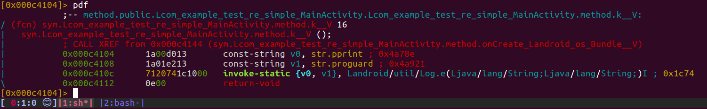

### apktool

出現錯誤訊息

```
$ apktool d ifonly.apk 
 10:03:50 up 17 min,  4 users,  load average: 0.01, 0.24, 0.53
USER     TTY      FROM             LOGIN@   IDLE   JCPU   PCPU WHAT
dio      tty7     :0               09:47   17:00  18.35s  0.23s /sbin/upstart --user
dio      pts/19   tmux(2334).%0    09:47    6.00s  0.24s  0.00s /bin/bash /usr/bin/apktool d ifonly.apk
dio      pts/4    tmux(2334).%1    09:51   12:38   0.01s  0.01s -bash
dio      pts/20   tmux(2334).%2    09:52    7:58   0.05s  0.05s -bash
I: Using Apktool 2.0.2-dirty on ifonly.apk
I: Loading resource table...
I: Decoding AndroidManifest.xml with resources...
I: Loading resource table from file: /home/dio/apktool/framework/1.apk
W: Could not decode attr value, using undecoded value instead: ns=android, name=versionCode, value=0x00000001
I: Loading resource table from file: /home/dio/apktool/framework/1.apk
W: Could not decode attr value, using undecoded value instead: ns=android, name=versionName, value=0x0000000c
I: Loading resource table from file: /home/dio/apktool/framework/1.apk
W: Could not decode attr value, using undecoded value instead: ns=android, name=versionCode, value=0x00000001
I: Loading resource table from file: /home/dio/apktool/framework/1.apk
W: Could not decode attr value, using undecoded value instead: ns=android, name=versionName, value=0x0000000c
Exception in thread "main" java.lang.NullPointerException
        at java.io.Writer.write(Writer.java:157)
        at brut.androlib.res.util.ExtMXSerializer.writeAttributeValue(ExtMXSerializer.java:38)
        at org.xmlpull.mxp1_serializer.MXSerializer.attribute(MXSerializer.java:673)
        at org.xmlpull.v1.wrapper.classic.XmlSerializerDelegate.attribute(XmlSerializerDelegate.java:106)
        at org.xmlpull.v1.wrapper.classic.StaticXmlSerializerWrapper.writeStartTag(StaticXmlSerializerWrapper.java:267)
        at org.xmlpull.v1.wrapper.classic.StaticXmlSerializerWrapper.event(StaticXmlSerializerWrapper.java:211)
        at brut.androlib.res.decoder.XmlPullStreamDecoder$1.event(XmlPullStreamDecoder.java:83)
        at brut.androlib.res.decoder.XmlPullStreamDecoder.decode(XmlPullStreamDecoder.java:141)
        at brut.androlib.res.decoder.XmlPullStreamDecoder.decodeManifest(XmlPullStreamDecoder.java:153)
        at brut.androlib.res.decoder.ResFileDecoder.decodeManifest(ResFileDecoder.java:140)
        at brut.androlib.res.AndrolibResources.decodeManifestWithResources(AndrolibResources.java:199)
        at brut.androlib.Androlib.decodeManifestWithResources(Androlib.java:140)
        at brut.androlib.ApkDecoder.decode(ApkDecoder.java:100)
        at brut.apktool.Main.cmdDecode(Main.java:165)
        at brut.apktool.Main.main(Main.java:81)
```

此處 apktool 是 ubuntu apt-get 安裝的版本

```
Apktool v2.0.2-dirty - a tool for reengineering Android apk files
with smali v2.0.8-dev and baksmali v2.0.8-dev
Copyright 2014 Ryszard Wiśniewski <brut.alll@gmail.com>
Updated by Connor Tumbleson <connor.tumbleson@gmail.com>
```

猜測是因為版本太舊導致

```
參考 https://ibotpeaches.github.io/Apktool/install/ 
安裝最新版 apktool 後，就可以解成 smali 了

[dio@dio-VirtualBox][re-env][0] $ apktool
Apktool v2.3.2 - a tool for reengineering Android apk files
with smali v2.2.2 and baksmali v2.2.2
Copyright 2014 Ryszard Wiśniewski <brut.alll@gmail.com>
Updated by Connor Tumbleson <connor.tumbleson@gmail.com>

usage: apktool
 -advance,--advanced   prints advance information.
 -version,--version    prints the version then exits
usage: apktool if|install-framework [options] <framework.apk>
 -p,--frame-path <dir>   Stores framework files into <dir>.
 -t,--tag <tag>          Tag frameworks using <tag>.
usage: apktool d[ecode] [options] <file_apk>
 -f,--force              Force delete destination directory.
 -o,--output <dir>       The name of folder that gets written. Default is apk.out
 -p,--frame-path <dir>   Uses framework files located in <dir>.
 -r,--no-res             Do not decode resources.
 -s,--no-src             Do not decode sources.
 -t,--frame-tag <tag>    Uses framework files tagged by <tag>.
usage: apktool b[uild] [options] <app_path>
 -f,--force-all          Skip changes detection and build all files.
 -o,--output <dir>       The name of apk that gets written. Default is dist/name.apk
 -p,--frame-path <dir>   Uses framework files located in <dir>.

For additional info, see: http://ibotpeaches.github.io/Apktool/ 
For smali/baksmali info, see: https://github.com/JesusFreke/smali

```

```
2018/04/12
現況：可用 apktool d ifonly-proguard-20180327.apk 解出 smali file。
     鎖定 MainActivity.smali 中的第 19 行，預計將 print 改成 pprint。
     目標是將改過的 smali 檔包回去 apk。
     包回去參考的文件是 https://blog.bramp.net/post/2015/08/01/decompile-and-recompile-android-apk/
     裡面用到了 apktool, keytool, jarsigner, zipalign 這些工具
下一步：在 ubuntu vm 裡建置這些工具，並加入 re-env 中。
```
```
2018/04/13
keytool, jarsigner vm 中已有。須確認是裝了什麼才有。

https://developer.android.com/studio/install.html
zipalign 要下載 android sdk 才有。
  /home/dio/Android/Sdk/build-tools/27.0.3/zipalign
```

```
2018/04/23

keytool, jarsigner 是在安裝完 openjdk-8-jdk 後才會有
```


```
2018/04/24

用 apktool repackage apk 成 ifonly-proguard-20180327-aligned.apk
並將之安裝置 genymotion 模擬器中
以 ./adb logcat 觀察 (~/Downloads/platform-tools/)

04-23 21:43:07.936  3262  3262 E pprint  : proguard

證實有 repackage 成功！
```


```
2018/04/25
https://github.com/18z/apk-re-forfun/blob/master/apktool-testenv/repackage.sh
```
