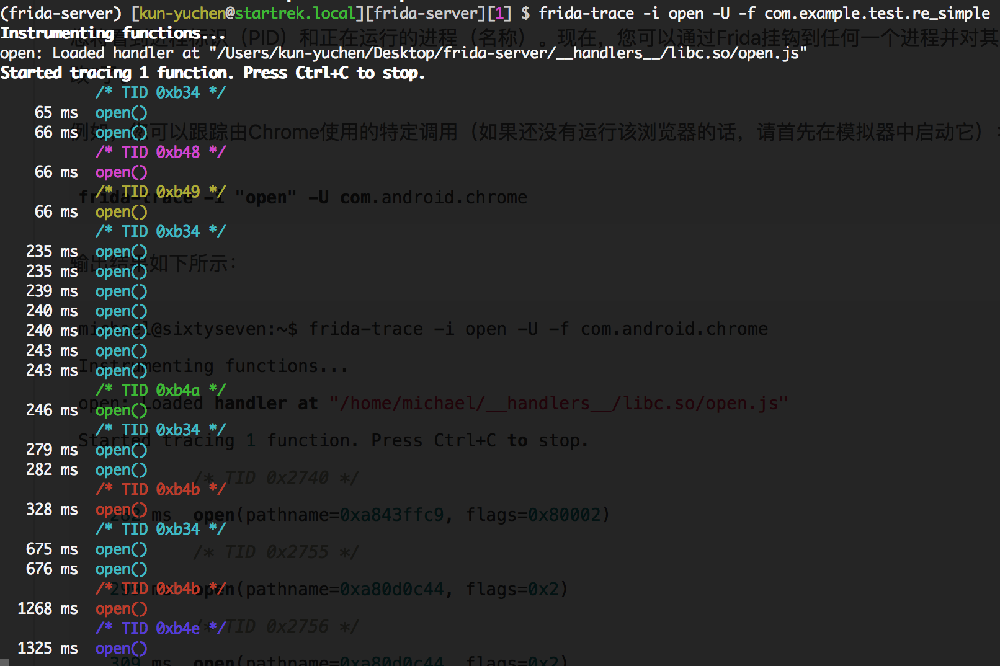
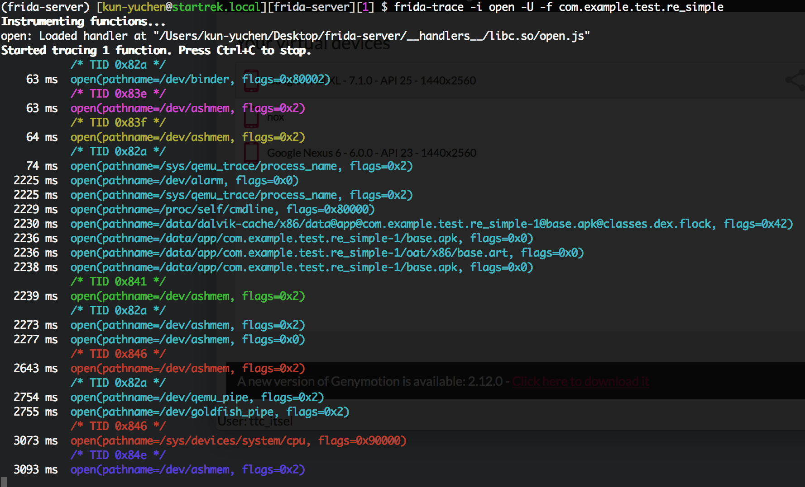

### frida

```
1. download frida-server
2. follow instructions like https://www.frida.re/docs/android/ and 
   https://github.com/dpnishant/appmon/wiki/5.a-Setup-on-Android-%5BRooted%5D
3. failed at $ adb shell "/data/local/tmp/frida-server &"
4. error msg: /system/bin/sh: /data/local/tmp/frida-server: No such file or directory
5. 疑似 /system/bin/sh 沒檔案。
6. Install frida on genymotion: https://www.youtube.com/watch?v=wJkn9AcK4l4
7. android 6.0 似乎就裝進去了 (didn't work out)
```


```
2018/04/27

Parktsai 大大 frida 文
https://github.com/parkmftsai/Reverse-apk-research/blob/master/learning_reverse_apk_record.md

決定來試一下
https://www.codemetrix.net/hacking-android-apps-with-frida-1/

frida-server binary 要挑 frida-server-10.7.7-android-x86
先前錯誤是因為 cpu 架構挑錯了。
```


```
2018/04/30

https://www.codemetrix.net/hacking-android-apps-with-frida-1/

By Michael Helwig 就是 Apk-anal 作者
Hacking Android Apps with Frida I (有 part II)
   作者認為 Frida 很好玩，很威。就像玩遊戲時開啟上帝模式一樣。
   第二篇會  solve a little android crackme.
What is Dynamic Binary Instrumentation? (動態二進制注入)
   是一種通過注入探針代碼實現二進制程序動態分析的技術
   inject foreign code into existing (running) binaries to make them do things they didn't do before.
   不是 exploiting， 因為並不是透過已知漏洞把 code 注入。
   也不是 debugging，因為沒有 attaching a debugger to the binary。
   那  DBI 可以用來幹嘛？
      Access process memory
      Overwrite functions while the application is running
      Call functions from imported classes
      Find object instances on the heap and use them
      Hook, trace and intercept functions etc. (對這個比較有感覺)
以上動作也可用 debugger 來做，但障礙多。例如要 disassemble and recompile APP 使它 debuggable.  
因為有些 app 會偵測並防止 debugger，因此我們必須繞過此邏輯。也不是不能用 debugger 做，但就是麻煩。用 Frida 就很快。
```

```
2018/05/01
1. 同步 android emulator 中 frida-server-android-x86 版本，以及 macos frida 版本為 10.8.0。
2. 啟動 frida-server in android emulator
3. frida-ps -U|less (In another terminal, 
   in a regular OS shell, check if Frida is running and lists processes on Android:)
4. 鎖定 com.android.browser
5. frida-trace -i "open" -U com.android.browser
```


```
2018/05/02
參考 https://www.frida.re/docs/frida-trace/

透過 frida-trace -U -f com.android.calendar 將 com.android.calendar 啟動。

trace API calls 還沒實驗成功。
```


```
2018/05/03

(frida-server) [kun-yuchen@startrek.local][frida-server][0] $ frida-trace --help
Usage: frida-trace [options] target

Options:

  -I MODULE, --include-module=MODULE
  -i FUNCTION, --include=FUNCTION
  
-----------
frida-discover : is a tool for discovering internal functions in a program, 
                 which can then be traced by using frida-trace.
                 
(frida-server) [kun-yuchen@startrek.local][frida-server][0] $ frida-discover -p 2226
Failed to attach: unable to find process with pid 2226
-----------

可參考
http://pwn4.fun/2017/05/05/Frida%E4%BD%BF%E7%94%A8%E8%AF%B4%E6%98%8E/
https://www.anquanke.com/post/id/85758

修改 open.js 

onEnter: function (log, args, state) {
    log("open(" + "pathname=" + Memory.readUtf8String(args[0])+ ", flags=" + args[1] + ")");
},

Question:
open 到底是什麼 function?
1. 自定義 apk 內 function。
2. import api function?
3. or else?
```

open.js 修改前



open.js 修改後



```
2018/05/04

先前 frida hook 結果中出現 base.apk。
好奇是什麼。

參考與整理
https://www.jianshu.com/p/ae45af3c3098

1. AndroidManifest.xml 被解析，
   解析結果儲存在 /data/system/packages.xml 和 /data/system/packages.list 中。
   此階段完成，相當於 app 在系統註冊了，可以被系統識別。
   
   * packages.list 中有 app 在 /data/ 中的儲存位置 /data/data/cn.hadcn.exampple
   * packages.xml 中包含
      * 權限
      * 簽名
      * 代碼所在位置
2. 保存 app 執行檔。
   * 依據 packages.xml 中 codePath 建立一目錄。
     apk 會被命名為 base.apk 並拷貝至此，lib 目錄則存放 native library。
     此時 app 就可以運行了。
     
3. 優化
   * 若每次運行都得從 base.apk 中提取 dex file。效率低。
   * Android 系統安裝時優化，將 dex file 提取後放在一起後優化成 odex file，存在 /data/dalvik-cache 中
   * 若是 ART 模式，使用 dex2oat 優化成 oat 文件，但檔案大小會大很多。
```
