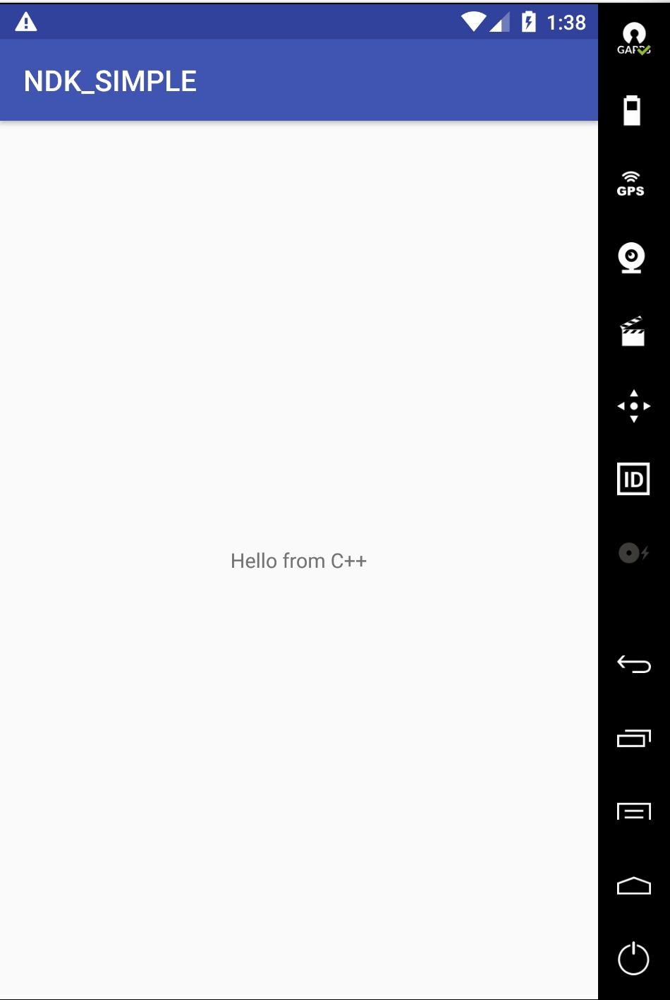
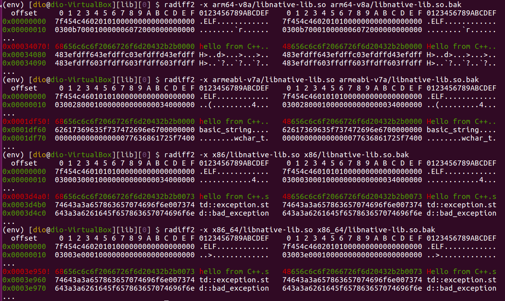
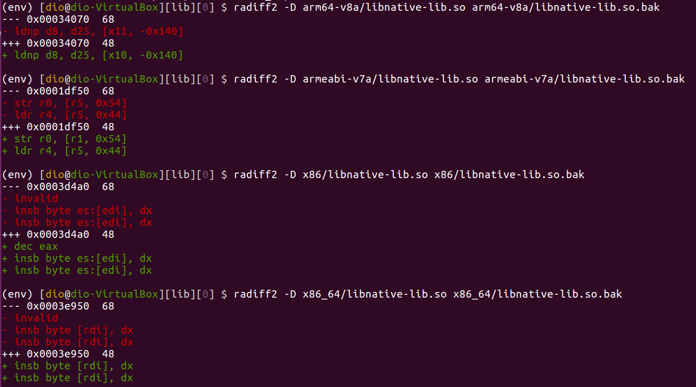
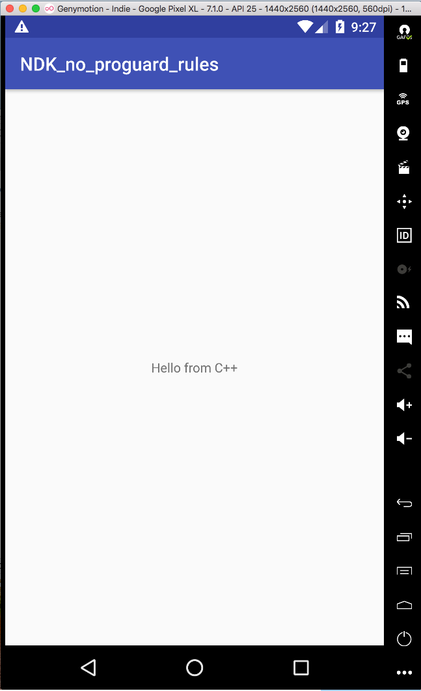
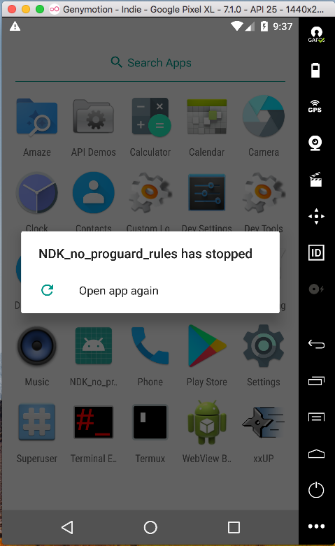
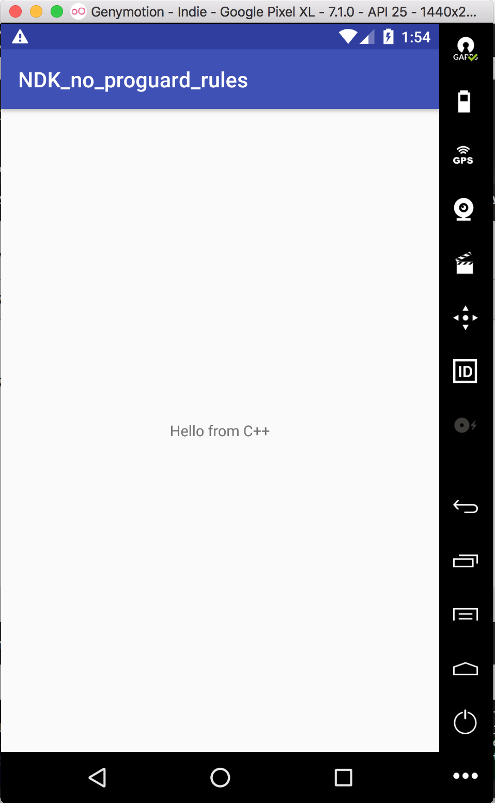
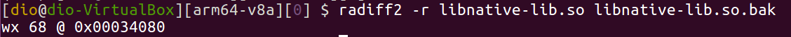

### Native Development Kit (NDK)

```
2018/05/08

ref: https://developer.android.com/ndk/guides/build

NDK 主要目的：build C and C++ source code 到 shared libary 中，使得 App 可以使用。

此部分解釋如何 build native binaries 在 android app 中。
以解釋 Android.mk 檔及 Application.mk 檔為開頭。

Android.mk:       which defines properties specific to individual modules, or libraries. 
                  (特定的，module, library)
Application.mk:   which defines properties for all the modules that you use in your app.
                  (all, modules use in the app)
```


```
2018/05/09

接著解釋如何使用 ndk-build 腳本。
最後，進階課題，如何 incorporate the NDK 到我們自己的 toolchain。如果我們不想用 ndk-build 的話。

看 https://blog.csdn.net/carson_ho/article/details/73250163

Android Studio 2.2 以上實現 NDK。感覺容易。

Generate Signed apk 時遇到版本 Resolve conflicts between the app and test APK 問題
https://developer.android.com/studio/test/?utm_source=android-studio#dependency_conflicts

後來是先更新 SDK 版本，接著修改 build.gradle，使得版本相同（這樣感覺有點不正規）
之後就成功 gen 出 NDK apk 了。

成功在模擬器上運作！
```




```
2018/05/10

實驗：patch .so 檔
結果：失敗

實驗步驟：
1. 以 apktool d NDK-simple.apk 將 apk 解開
2. 以 r2 -w 修改 lib/arm64-v8a, armeabi-v7a, x86, x86_64 中的 libnative-lib.so 
   將內部字串 Hello from C++ 改成 HELLO FROM CPP
3. 以 apk-re-forfun 中的 repackage.sh 將改過的 .so 檔重新包裝
4. 將 apk 送進 genymotion 中運行，字串還是 Hello from C++，實驗失敗。
5. 試圖以 grep -r "Hello" . 在  NDK-simple 目錄下找尋，發現
   Binary file ./lib/x86_64/libnative-lib.so matches
   Binary file ./build/apk/res/layout/activity_main.xml matches
   Binary file ./build/apk/lib/x86_64/libnative-lib.so matches
   因此懷疑，可能有其他地方沒改到。
```

```
2018/05/11
實驗：patch .so 檔
結果：失敗

實驗步驟：
1. 以 apktool d NDK-simple.apk 將 apk 解開
2. 以 vim 修改 lib/arm64-v8a, armeabi-v7a, x86, x86_64 中的 libnative-lib.so 
   將內部字串 Hello from C++ 改成 HELLO from C++
3. 以 apk-re-forfun 中的 repackage.sh 將改過的 .so 檔重新包裝
4. 將 apk 送進 genymotion 中運行，顯示 NDK_SIMPLE has stopped。跑不起來。

5. 發現 x86_64/.so 中，有另一處出現 Hello 字串。將之也改成 HELLO 後，重包。
   一樣遇到 NDK_SIMPLE has stopped 問題。
6. 只修改 x86/.so，重包後送到虛擬機中，一樣是 Hello from C++。 
```


```
2018/05/14

用了 radiff2 兩個參數 -x, -D 來看 .so 檔
-D 發現，x86, x86_64 都有 invalid。
```




```
2018/05/15

ChenJS's solution
editor 直接編輯 .so file
前提是，該 apk 在打包時已先把 proguard-rules.pro 拿掉，避免驗證。

試試看打包一個無 proguard-rules.pro 的 apk
再試著直接用編輯器改 .so file。
再用 apktool 回包。

註記：此法與 r2 改法不同。
r2 改完的結果，可以執行，但字串沒改。
編輯器直接改法，直接閃退。
```

```
2018/05/16
實驗：patch .so 檔
結果：失敗

實驗步驟：
1. 撰寫 1 ndk apk。直接刪除 proguard-rules.pro。
2. generate signed apk。
3. 跑在 genymotion 中，成功！
4. vim 直接改 proguard-rules.pro excluded apk。
5. 將改過的 apk 試跑在 genymotion 中，閃退。
```




```
2018/05/17
實驗：patch .so 檔
結果：失敗

實驗步驟：

1. 以 r2 修改 signed apk (with no proguard-rules.pro)。
2. 跑在 genymotion 中。
3. app 沒閃退，但字串不變。@@
```




```
2018/05/18

常改 .so，試想寫 r2script 自動化改 .so 檔
1. 搜尋 Hello 字串，相對記憶體位置。
2. 跳至該相對記憶體位置。
3. 修改字元 H 至小寫 h。

似乎可以用 radiff2 的某參數找到相關修改指令。
```


```
2018/05/21
列出所有 android 內檔案，並解釋用途。
```
