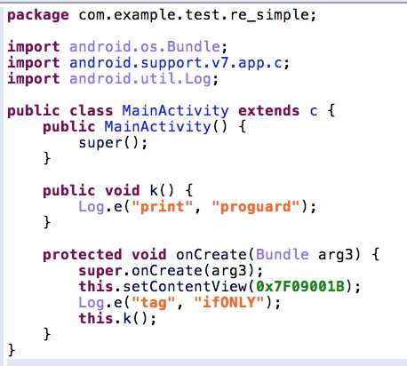
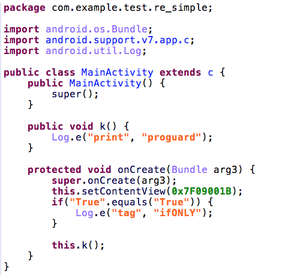

### proguard

```java
package com.example.test.re_simple;

import android.support.v7.app.AppCompatActivity;
import android.os.Bundle;
import android.util.Log;

public class MainActivity extends AppCompatActivity {

    @Override
    protected void onCreate(Bundle savedInstanceState) {
        super.onCreate(savedInstanceState);
        setContentView(R.layout.activity_main);
        if(5 > 4) {
            Log.e("tag", "ifONLY");
        }
        print();
    }

    public void print(){
        Log.e("print", "proguard");
    }
}
```



```
jeb 似乎會把 is always true 的條件判斷直接忽略。
No.
是編譯器處理掉了。
開啟 r2 直接看 opcodes + smali code 結果，裡面已經沒有 is always true 的條件判斷了。
```

```java
package com.example.test.re_simple;

import android.support.v7.app.AppCompatActivity;
import android.os.Bundle;
import android.util.Log;

public class MainActivity extends AppCompatActivity {

    @Override
    protected void onCreate(Bundle savedInstanceState) {
        super.onCreate(savedInstanceState);
        setContentView(R.layout.activity_main);
        String FLAG = "True";
        if(FLAG.equals("True")){
            Log.e("tag", "ifONLY");
        }
        print();
    }

    public void print(){
        Log.e("print", "proguard");
    }
}
```

