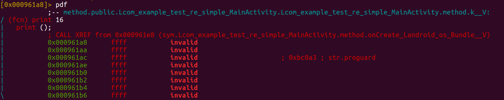

### r2project

```
afn print
Ps file (save project)

Pl (list projects)
Po file (open project)

encounter this bug
https://github.com/radare/radare2/issues/9574
```



```
2018/04/24

sys/user.sh
發現 project.c 有更新，似乎把 bug 解掉了？
```
