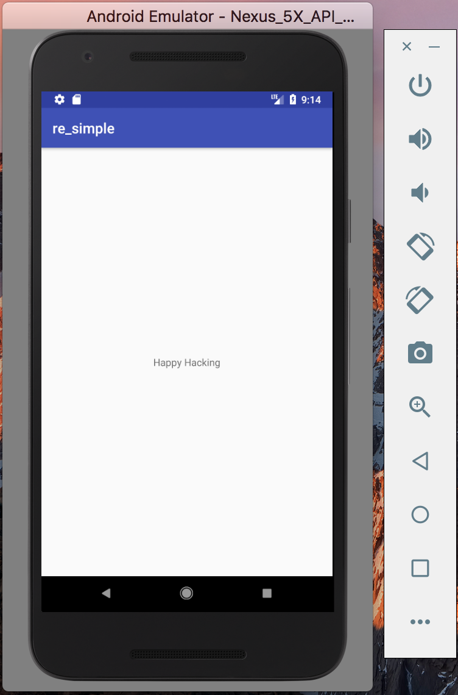

### - 0101 - Apk 自寫自逆 - 撰寫簡易 Apk

本系列文希望透過撰寫簡易 Apk，一次增加與關注一小部分。學習與熟習逆向 Apk 方法。

參考官方網站 [[1]](https://developer.android.com/training/basics/firstapp/index.html) 寫法，撰寫一簡易 Apk。Apk 執行後只會在空白頁中顯示 Happy Hacking。此外無其他功能，執行結果如下圖所示。

Apk 檔：[app-release.apk](app-release.apk)。

#### 參考文獻
1. https://developer.android.com/training/basics/firstapp/index.html