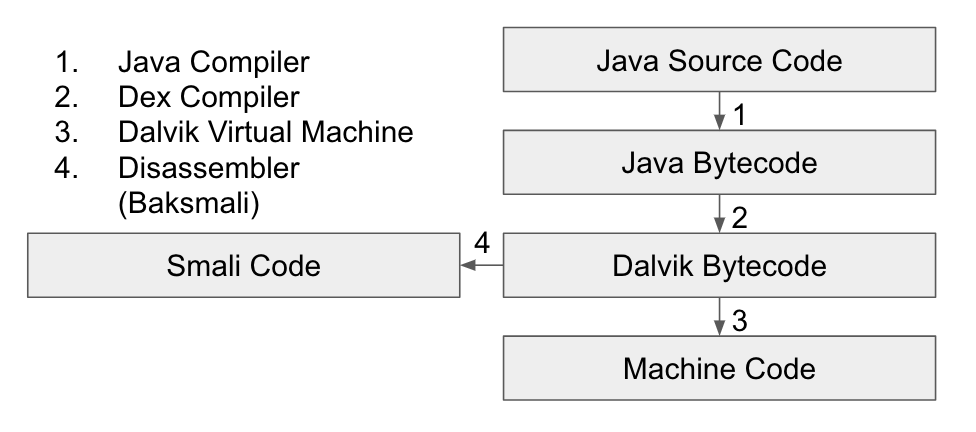

### Apk 自寫自逆 - 系列 1

目的：透過撰寫簡易 Apk，一次關注一小段程式碼。學習與熟習逆向 Apk 方法。

Apk 檔：[app-release.apk](app-release.apk)。

參考[官方網站](https://developer.android.com/training/basics/firstapp/index.html)寫法，撰寫一簡易 Apk。Apk 執行後只會在空白頁中顯示 Happy Hacking。此外無其他功能，執行結果如下圖所示。


在真正開始進入主題前，我們先了解每個 activity 執行後，會有哪些流程。


從上圖，可看到 activity 在 launched 後，首先會執行的是 onCreate() 函式。在此，我們只需知道這點就好。由於此處，我們的 app 非常簡單，因此不會有其他的函式。

每個 app 執行後，會先從 AndroidManifest.xml 中找尋 main activity，這就會是我們的切入點。而在此 app 中，我們的 main activity 就是 MainActivity.java 這支程式。

因此，我們先來看 MainActivity.java。

```java
package com.example.test.re_simple;

import android.support.v7.app.AppCompatActivity;
import android.os.Bundle;

public class MainActivity extends AppCompatActivity {

    @Override
    protected void onCreate(Bundle savedInstanceState) {
        super.onCreate(savedInstanceState);
        setContentView(R.layout.activity_main);
    }
}
```

```package com.example.test.re_simple;```

* 表示 MainActivity.java 會在 com/example/test/re_simple 資料夾結構下。

```import android.support.v7.app.AppCompatActivity;```

* MainActivity 繼承函式 ```onCreate()```、```setContentView()``` 自 AppCompatActivity 類別。

```import android.os.Bundle;```

* 餵參數給 onCreate() 時會用到。依據[官方手冊](https://developer.android.com/guide/components/activities/activity-lifecycle.html)定義：This method receives the parameter savedInstanceState, which is a Bundle object containing the activity's previously saved state. If the activity has never existed before, the value of the Bundle object is null. 

```public class MainActivity extends AppCompatActivity ```

* 宣告 public class MainActivity，特性繼承自 AppCompatActivity。

```@Override```

* 重新定義 onCreate()

```protected void onCreate(Bundle savedInstanceState)```

* 新定義的 onCreate()，回傳為 void。

```super.onCreate(savedInstanceState);```

* 呼叫 AppCompatActivity 定義的 onCreate() 以處理 savedInstanceState

```setContentView(R.layout.activity_main);```

* 設定初始畫面。```R.layout.activity_main``` 為欲設定之內容。


再來，我們來看 R.layout.activity_main 之內容。其實，它是個 xml 檔，內容如下。

```xml
<?xml version="1.0" encoding="utf-8"?>
<android.support.constraint.ConstraintLayout xmlns:android="http://schemas.android.com/apk/res/android"
    xmlns:app="http://schemas.android.com/apk/res-auto"
    xmlns:tools="http://schemas.android.com/tools"
    android:layout_width="match_parent"
    android:layout_height="match_parent"
    tools:context="com.example.test.re_simple.MainActivity">

    <TextView
        android:layout_width="wrap_content"
        android:layout_height="wrap_content"
        android:text="Happy Hacking"
        app:layout_constraintBottom_toBottomOf="parent"
        app:layout_constraintLeft_toLeftOf="parent"
        app:layout_constraintRight_toRightOf="parent"
        app:layout_constraintTop_toTopOf="parent" />

</android.support.constraint.ConstraintLayout>
```

這裏只要關注 ```android:text```。預設值是 ```Hello World```，我修改成```Happy Hacking```。

以上，針對此 apk 兩個重要檔案已講解完畢。以下，我們開始逆！



我們專注看的是 Smali Code。

上圖建構所參考之文獻：
* [What is smali code android](https://stackoverflow.com/questions/30837450/what-is-smali-code-android)
* [Programming with Android - System Architecture](https://www.slideshare.net/uT916/android-architecture-and-additional-components)
* [Smali](https://github.com/JesusFreke/smali)

文中，我們只用一個工具逆向，[radare2](http://rada.re/r/)。

```bash
# 將 apk 解壓縮至 dex 資料夾
$ unzip app-release.apk -d dex 

# 進入 dex 資料夾
$ cd dex

# 用 radare2 開始分析
# -A: run 'aaa' command to analyze all referenced code
# -a [arch]: set asm.arch
$ radare2 -Aa dalvik classes.dex

# 定位 MainActivity 中的 onCreate()
$ ic~MainActivity~onCreate
0x0017c99c method 1 r    Lcom/example/test/re_simple/MainActivity.method.onCreate(Landroid/os/Bundle;)V

# 跳到記憶體位置
$ s 0x0017c99c

# 印出 onCreate() 的 dalvik opcode
$ pdf

[0x0017c99c]> pdf
            ;-- entry10:
            ;-- method.protected.Lcom_example_test_re_simple_MainActivity.Lcom_example_test_re_simple_MainActivity.method.onCreate_Landroid_os_Bundle__V:
/ (fcn) sym.Lcom_example_test_re_simple_MainActivity.method.onCreate_Landroid_os_Bundle__V 20
|   sym.Lcom_example_test_re_simple_MainActivity.method.onCreate_Landroid_os_Bundle__V ();
|           0x0017c99c      6f20e72b2100   invoke-super {v1, v2}, Landroid/support/v7/app/AppCompatActivity.onCreate(Landroid/os/Bundle;)V ; aav.0x00002be7 ; MainActivity.java:10 ; sym.Landroid_support_v7_app_AppCompatActivity.method.onCreate_Landroid_os_Bundle__V
|           0x0017c9a2      14001b00097f   const v0, 0x7f09001b
|           0x0017c9a8      6e20dd410100   invoke-virtual {v1, v0}, Lcom/example/test/re_simple/MainActivity.setContentView(I)V ; aav.0x000041dd
\           0x0017c9ae      0e00           return-void

# 忽略一切註解。先專注看 opcode
0x0017c99c      6f20e72b2100   invoke-super {v1, v2}, Landroid/support/v7/app/AppCompatActivity.onCreate(Landroid/os/Bundle;)V ; aav.0x00002be7
0x0017c9a2      14001b00097f   const v0, 0x7f09001b
0x0017c9a8      6e20dd410100   invoke-virtual {v1, v0}, Lcom/example/test/re_simple/MainActivity.setContentView(I)V ; aav.0x000041dd
0x0017c9ae      0e00           return-void
```

開始解讀 opcode 之前，我們得先準備幾份參考資料。

1. [dalvik opcodes](http://pallergabor.uw.hu/androidblog/dalvik_opcodes.html)
2. [smali - Types Methods and Fields](https://github.com/JesusFreke/smali/wiki/TypesMethodsAndFields)
3. [smali - Registers](https://github.com/JesusFreke/smali/wiki/Registers)


